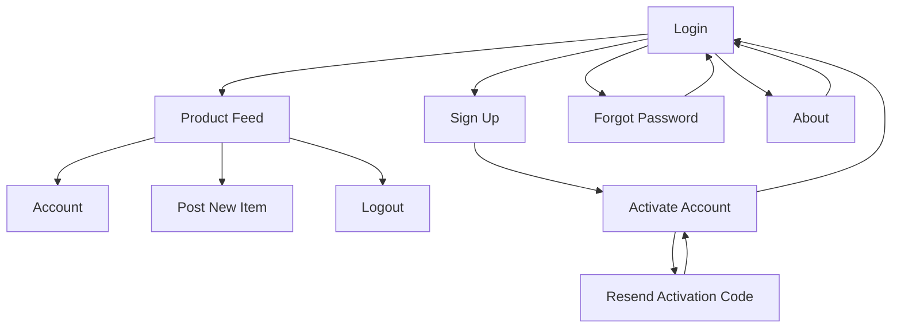

# Niner Miner - E-commerce for UNCC Students

This web application is a project created for ITSC 4155 Software Engineering Capstone (Spring 2022).
The goal is to create an e-commerce platform similar to OfferUp and Craigslist that allows for UNCC
students to buy and sell personal goods. The unique feature we seek to offer is using
UNCC email verification to ensure that only legitimate UNCC students are involved in
buying and selling. This helps overcome the issue of anonymity that causes so many
problems on already existing services. Our service will provide an additional layer of
security and trust to students and incentivize them to use our platform instead of the
competitors.

The contributing members for this project are:
- [Oviya Manoharan](https://github.com/oviya23)
- [Hinal Makadiya](https://www.linkedin.com/in/hinal-makadiya-60838b207/)
- Dane Medlin
- [Drew Moore](https://github.com/drew18moore)
- [Christian Madajski](https://www.linkedin.com/in/cmadajsk/) [](https://wakatime.com/badge/user/510092ca-a9b8-48f5-bf50-9b05005ef525/project/a5b9008a-d413-431f-92d4-80beef67c7cc)

The technologies being used are:
- Python/Flask (Backend + Logic)
- SQLAlchemy (Database)
- HTML/CSS/JS (Frontend)
- Google Maps (Mapping)
- Stripe (Financial Services)
- Linode/Nginx/Gunicorn (Server)
- Socket.IO (Messaging)

## Accessing the App

The app is now up and running on a Linode server. Use [this link](http://194.195.214.161/) to access the live demo. To log in, use the following credentials:

email: demo@uncc.edu

password: demo1234

## App Installation (for running locally)

Before running any scripts, make sure to check if you have Python installed on your machine. If you aren't sure, 
{download the latest version of Python](https://www.python.org/downloads/) and install it on your system.

If you are running Windows on your machine, it is also necessary to have Git Bash for Windows installed. 
If you don't have it already, please [download the latest version](https://git-scm.com/downloads) and install it on your system.

The easiest way to clone the repository is to use the HTTPS method. When inside of your preferred shell 
(Git Bash, Bash, zsh, ect), use the command ```git clone https://github.com/cmadajski/niner_miner.git``` 
and the files will be downloaded to your local system.

For more advanced users, SSH is an even better way to interact with GitHub repos. For detailed instructions 
on using SSH with GitHub, [check out this webpage.](https://docs.github.com/en/authentication/connecting-to-github-with-ssh)

For your convenience, we made a single script that creates a virtual environment, installs dependencies, 
and creates the database automatically. In the niner_miner directory, open the ```install``` directory. 
- if you are using Git Bash for Windows, use the command ```./app_install_windows_gitbash.sh```
- if you are using Mac(zsh) or Linux(bash, dash, etc), use the command ```./app_install_mac_linux.sh```

Once you run the above script you must manually activate the virtual environment by navigating to the ```niner_miner``` directory and using the command ```source env/Scripts/activate``` on Windows machines or ```source env/bin/activate``` on Mac/Linux to start the virtual environment.

## Running the Code
Navigate to the ```src``` directory. Then use the command ```python main.py``` to start
the development server and allow access to the app.

An IP Address should be visible in the console, and you can either ctl+click the address
or copy and paste the address into a web browser to view the app. You can also manually
enter this address into your webbrowser if needed: ```http://127.0.0.1:5000/```

## Resetting the Database
While we are in the process of building and testing the application, it is sometimes necessary to delete and 
rebuild the database to remove existing data and start from scratch. To simplify this process, a script in the
```src/``` directory named reset_db.py automates the process of resetting the database. This should only be necessary if any models change or new models are added.

To reset the command the command ```python reset_db.py```

## Basic Application Flow



The landing page for the appliation is the login page. Ideally, a person should not be able to access any of the app features without first logging in. This way, we can limit app usage to only valid UNCC students.

If you do not have an account on Niner Miner, then you can click the "Become a Member" link to navigate to the sign up page.

All fields on the sign up page require input in order to submit. Here are some of the submission rules:
- UNCC ID must be unique to all users currently in the database
- Email address must contain the string '@uncc.edu'
- Email address must not be associated with another Niner Miner account
- Password must be 8 or more characters
- Both Password fields must match exactly

Once sign up submission is successful, you will be redirected to the validation page and an email will be sent to the provided email address that contains a six digit code. The code must be provided, along with your email, on the validation page in order to activate your account. An account must be activated before a user can acccess Niner Miner services.

If you encounter an error during the validation process, you can use the "resend email" link to send another email with a new validation code.

Once validation is successful, you will be redirected to the login page. Use your email and password to log in to the Niner Miner service.

The above features are the only 100% completed features for Sprint 2.

--------------------------------------------------------------------------------------------------------------------

We do have other systems implemented, but they are only partially functional and do not meet the criteria necessary for "definition of done".

On the post page, you can add new items that you would like to sell. The interface needs to be overhauled to improve clarity and better use available screen space. Also, there is an issue where the price can only accept integer values. There is also supposed to be a Google Map showing meeting locations, but that has been moved to Sprint 4.

Any new items added for sale will be shown on the product feed page. All images are placeholders and there is no search or sort functionality yet.
