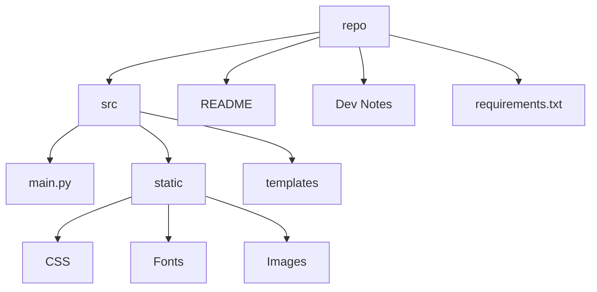

# Developer Notes for Niner Miner Web Application
This document provides a brief overview of the technical aspects of
the Niner Miner Webapp.
## Basic File Structure
This diagram shows the basic directory structure for the application.

